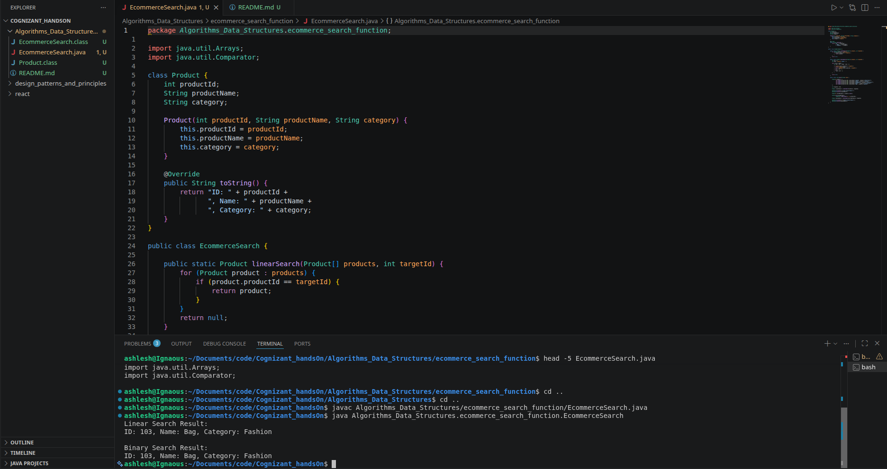

# E-commerce Platform Search Function

## Objective
Implement Linear Search and Binary Search for product searching and compare their performance using asymptotic analysis.

## Big O Notation
Big O notation describes the growth of an algorithm's running time as the input size increases.

## Search Cases
- Best Case
- Average Case
- Worst Case

## Product Class
Attributes:
- productId
- productName
- category

## Implementation
- Linear Search
- Binary Search

## Output

## Time Complexity Comparison

| Algorithm | Best | Average | Worst |
|------------|------|---------|--------|
| Linear Search | O(1) | O(n) | O(n) |
| Binary Search | O(1) | O(log n) | O(log n) |

## Conclusion

Binary Search is more efficient than Linear Search for large product datasets because it reduces the search space by half in each iteration, resulting in O(log n) time complexity.