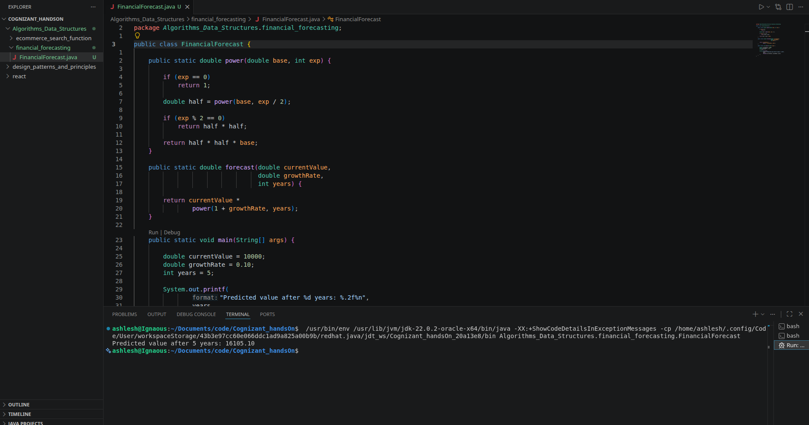

# Exercise 7: Financial Forecasting

## Objective

Develop a financial forecasting tool that predicts future values based on past growth rates using a recursive algorithm in Java.

---

## Understanding Recursion

Recursion is a programming technique where a method calls itself to solve a smaller instance of the same problem. A recursive solution typically consists of:

* **Base Case:** Stops the recursion.
* **Recursive Case:** Calls the method again with a smaller input.

Recursion can simplify problems that can be broken down into smaller subproblems.

---

## Problem Statement

Predict the future value of an investment using a fixed annual growth rate.

### Formula

Future Value = Present Value × (1 + Growth Rate)^Years

For example:

* Present Value = 10000
* Growth Rate = 10% (0.10)
* Years = 5

Expected Future Value:

16105.10

---

## Implementation

The recursive algorithm calculates the future value year by year until the number of years reaches zero.

### Base Case

```java
if (years == 0) {
    return currentValue;
}
```

### Recursive Case

```java
return forecast(
    currentValue * (1 + growthRate),
    growthRate,
    years - 1
);
```

---

## Time Complexity Analysis

### Simple Recursive Solution

* Time Complexity: **O(n)**
* Space Complexity: **O(n)**

where **n** is the number of years.

Each recursive call processes one year and creates one stack frame.

---

## Optimization

The recursive solution can be optimized using **Fast Exponentiation (Divide and Conquer)** to compute:

```text
(1 + growthRate)^years
```

This reduces:

* Time Complexity from **O(n)** to **O(log n)**
* Space Complexity from **O(n)** to **O(log n)**

---

## Output



---

## Sample Output

```text
Predicted value after 5 years: 16105.10
```

---

## Conclusion

This exercise demonstrates how recursion can be used for financial forecasting. The basic recursive approach is simple and easy to understand, while the optimized divide-and-conquer approach significantly improves performance for larger forecasting periods.
