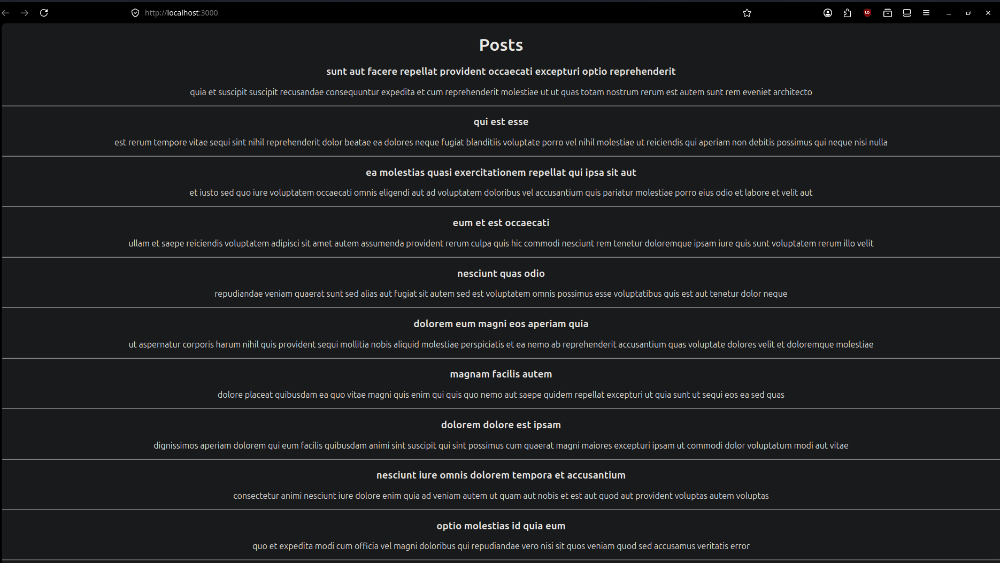

# ReactJS HOL Assessment - 4. ReactJS-HOL

## Objective

- Implement `componentDidMount()`
- Implement `componentDidCatch()`
- Fetch posts using Fetch API
- Display posts using React Class Components

## Run the Project

```bash
npm install
npm start
```

## Output Screenshot



## Technologies Used

- ReactJS
- JavaScript
- Fetch API
- Node.js
```