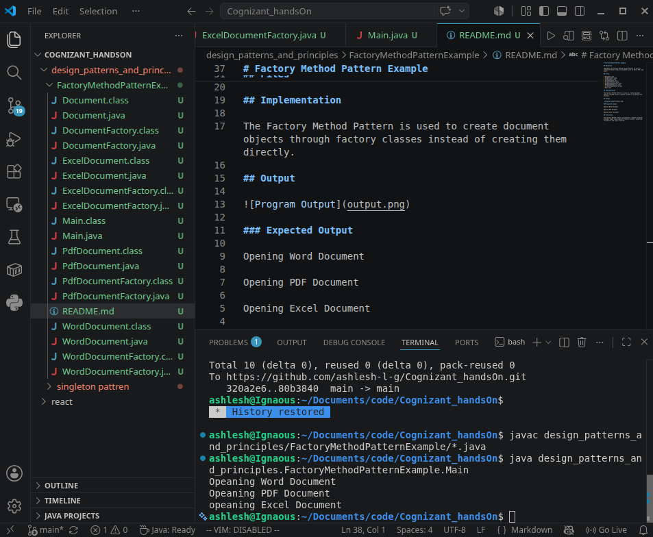

# Factory Method Pattern Example

## Objective

Implement the Factory Method Design Pattern in Java to create different types of documents such as Word, PDF, and Excel.

## Files

* Document.java
* WordDocument.java
* PdfDocument.java
* ExcelDocument.java
* DocumentFactory.java
* WordDocumentFactory.java
* PdfDocumentFactory.java
* ExcelDocumentFactory.java
* Main.java

## Implementation

The Factory Method Pattern is used to create document objects through factory classes instead of creating them directly.

## Output

### Expected Output

Opening Word Document

Opening PDF Document

Opening Excel Document

## Conclusion

The Factory Method Pattern successfully creates different document types using separate factory classes, promoting flexibility and loose coupling.
