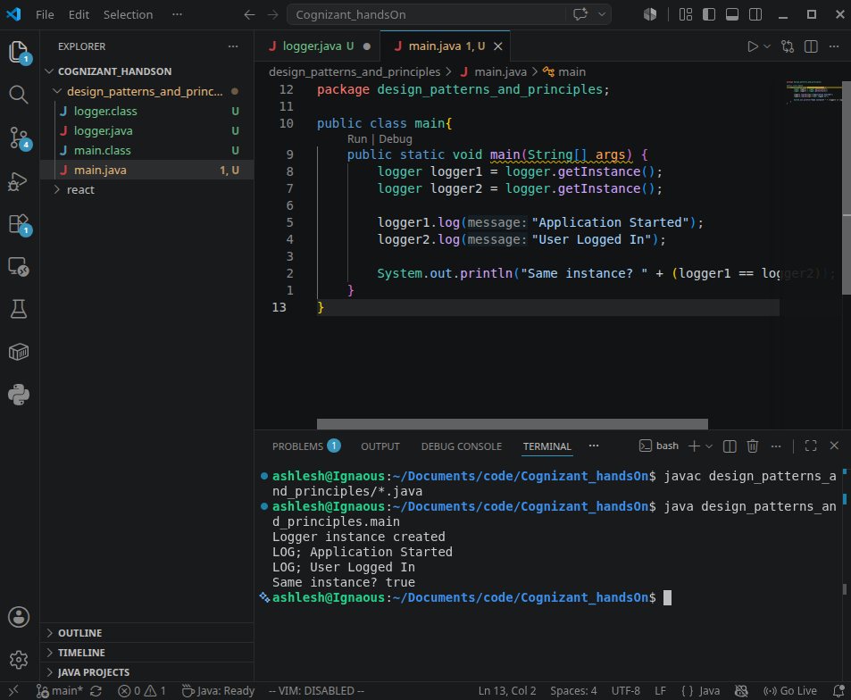

# Singleton Pattern Example

## Objective

Implement the Singleton Design Pattern in Java to ensure that only one instance of the `logger` class is created and used throughout the application.

## Files

* `logger.java`
* `main.java`

## Implementation

The `logger` class follows the Singleton Pattern by:

* Using a private static instance variable.
* Making the constructor private.
* Providing a public static `getInstance()` method to access the single instance.

## Output



### Expected Output

```text
Logger instance created
LOG; Application Started
LOG; User Logged In
Same instance? true
```

## Conclusion

The output confirms that only one instance of the `logger` class is created and shared across the application.
