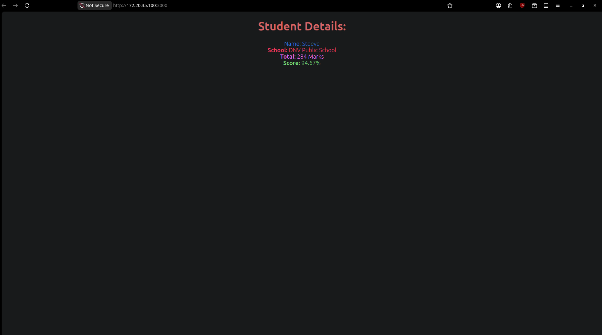

# Score Calculator App - 3. ReactJS-HOL

A ReactJS application developed as part of a Hands-On Lab to demonstrate Functional Components, Props, and CSS Styling.

## Technologies Used

- ReactJS
- JavaScript
- CSS
- Node.js

## Output

## Author

Your Name